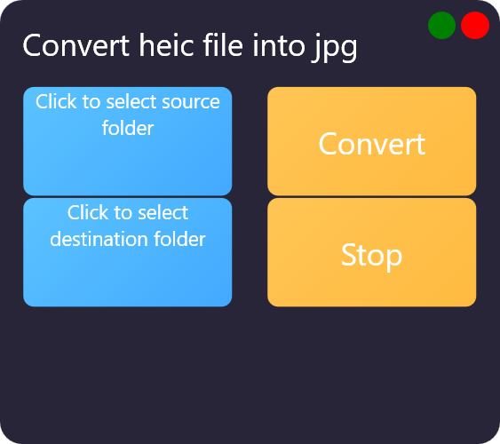
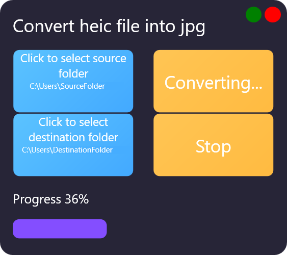

# HeicToJpg

**HeicToJpg** is an application that lets you convert .heic-files to jpg.
You can select a source-folder where all heic files to be converted are located and a destination folder where all converted files are stored.

## Download

- 🟢 **[First release](https://github.com/GoldenxSun/HeicToJpg/releases/tag/v2.2.0)**

## Features

- Convert heic file to jpg
- Stop conversion

## Screenshots

